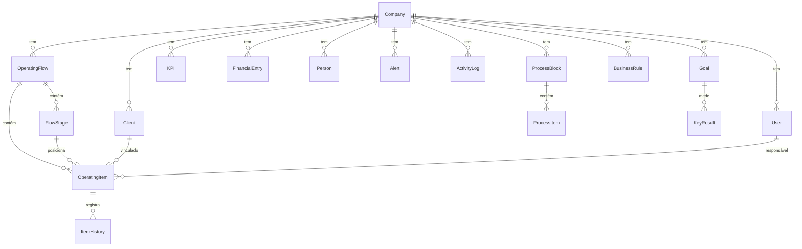

# SAAS_YF — Arquitetura do Sistema

## Visão Geral

```
┌──────────────────────────────────────────────────────────────────────────────┐
│                          SAAS_YF - Sistema de Gestão Empresarial            │
├──────────────────────────────────────────────────────────────────────────────┤
│                                                                              │
│  ┌──────────────────┐    HTTPS/REST     ┌──────────────────┐                │
│  │   Frontend (SPA) │ ◄──────────────► │    Backend API   │                │
│  │   React + Vite   │                   │  Express + Node  │                │
│  │   Port 5173      │                   │  Port 3000       │                │
│  └───────┬──────────┘                   └───────┬──────────┘                │
│          │                                       │                           │
│    Vercel                                  Railway                          │
│                                                  │                           │
│                                         ┌────────▼─────────┐                │
│                                         │   PostgreSQL     │                │
│                                         │   (Prisma ORM)   │                │
│                                         └──────────────────┘                │
└──────────────────────────────────────────────────────────────────────────────┘
```

## Stack Tecnológico

| Camada | Tecnologia | Versão |
|--------|-----------|--------|
| Frontend | React | 19.2 |
| Build Tool | Vite | 7.3 |
| Roteamento | React Router DOM | 7.13 |
| Ícones | Lucide React | 0.564 |
| Gráficos | Recharts | 3.7 |
| Backend | Express | 4.21 |
| ORM | Prisma | 6.4 |
| Banco de Dados | PostgreSQL | — |
| Autenticação | JWT (jsonwebtoken) | 9.0 |
| Hash de Senhas | bcryptjs | 2.4 |
| Rate Limiting | express-rate-limit | 7.5 |
| Deploy Frontend | Vercel | — |
| Deploy Backend | Railway | — |

## Estrutura de Diretórios

```
SAAS_YF/
├── src/                          # Frontend React
│   ├── components/
│   │   ├── Layout/               # MainLayout, PrivateRoute, ErrorBoundary,
│   │   │                         # AuthContext, ToastContext, LoadingSkeleton,
│   │   │                         # Pagination
│   │   ├── Dashboard/            # CashFlowChart, StaticCashFlowChart
│   │   ├── Modal/                # Modal, ConfirmDialog
│   │   ├── Config/               # Componentes de configuração
│   │   └── Processes/            # ActionPlanModal
│   ├── pages/                    # 17 páginas da aplicação
│   │   ├── Dashboard.tsx         # Painel central com SGE Score e simulação
│   │   ├── Financeiro.tsx        # CRUD de lançamentos financeiros
│   │   ├── Pessoas.tsx           # CRUD de colaboradores
│   │   ├── Clientes.tsx          # CRUD de clientes
│   │   ├── ClienteDetail.tsx     # Detalhe + inteligência do cliente
│   │   ├── KPIs.tsx              # CRUD de indicadores
│   │   ├── Metas.tsx             # OKRs com Key Results
│   │   ├── Fluxos.tsx            # Kanban operacional
│   │   ├── Processos.tsx         # Maturidade de processos
│   │   ├── Operacao.tsx          # Métricas operacionais (read-only)
│   │   ├── Alertas.tsx           # Alertas com auto-scan IA
│   │   ├── Relatorios.tsx        # Geração de relatórios
│   │   ├── Config.tsx            # Configurações + Audit Log
│   │   ├── Empresa.tsx           # Perfil da empresa + gestão de usuários
│   │   ├── Onboarding.tsx        # Wizard de setup inicial
│   │   ├── Login.tsx             # Autenticação
│   │   ├── ForgotPassword.tsx    # Recuperação de senha
│   │   └── ResetPassword.tsx     # Redefinição de senha
│   ├── services/
│   │   └── api.ts                # Cliente HTTP centralizado
│   ├── hooks/
│   │   └── useApi.ts             # Hook genérico de fetching
│   ├── types/
│   │   └── api.ts                # Interfaces TypeScript
│   ├── utils/
│   │   └── csvUtils.ts           # Utilitário de exportação CSV
│   └── data/                     # Mock data (deprecated)
│
├── backend/                      # Backend Express
│   ├── src/
│   │   ├── routes/               # 15 arquivos de rotas
│   │   │   ├── auth.ts           # login, register, forgot/reset password, me
│   │   │   ├── clients.ts        # CRUD + intelligence
│   │   │   ├── flows.ts          # CRUD + stages + analytics
│   │   │   ├── items.ts          # CRUD + move + close
│   │   │   ├── processes.ts      # CRUD + diagnosis + actions
│   │   │   ├── kpis.ts           # CRUD
│   │   │   ├── financial.ts      # CRUD + summary + projection
│   │   │   ├── people.ts         # CRUD + summary
│   │   │   ├── alerts.ts         # CRUD + resolve + dismiss
│   │   │   ├── company.ts        # Read + Update + Users
│   │   │   ├── dashboard.ts      # Aggregated read-only
│   │   │   ├── operations.ts     # Metrics read-only
│   │   │   ├── logs.ts           # Activity logs
│   │   │   ├── goals.ts          # CRUD + key results + sync
│   │   │   └── rules.ts          # CRUD de regras de negócio
│   │   ├── services/
│   │   │   ├── goalsService.ts   # Sync automático de KR
│   │   │   ├── rules.ts          # Motor de regras de negócio
│   │   │   ├── actionPlanService.ts # Geração de planos de ação
│   │   │   └── mailService.ts    # Envio de emails
│   │   ├── middleware/
│   │   │   ├── auth.ts           # JWT + RBAC (checkRole)
│   │   │   └── errorHandler.ts   # Error handler global
│   │   ├── lib/
│   │   │   ├── prisma.ts         # Singleton Prisma Client
│   │   │   ├── log.ts            # Activity Log helper
│   │   │   └── cache.ts          # In-memory cache (node-cache)
│   │   ├── app.ts                # Express app config
│   │   └── server.ts             # Entry point
│   └── prisma/
│       ├── schema.prisma         # 14 modelos de dados
│       ├── seed.ts               # Dados iniciais
│       └── migrations/           # Histórico de migrations
```

## Modelos de Dados (Prisma)



## Segurança

- **Autenticação**: JWT com expiração de 7 dias
- **RBAC**: Roles `admin`, `manager`, `viewer` com middleware `checkRole()`
- **Rate Limiting**: 100 req/15min (geral), 10 req/hora (auth)
- **CORS**: Whitelist de origens permitidas
- **Password**: Hash com bcrypt (10 salt rounds)
- **Multi-tenancy**: Todas as queries filtradas por `companyId` do JWT

## Padrões de Código

### Activity Logging
Toda mutação registra log via `logActivity()` com: action, module, entityId, entityName, details.

### Business Rules Engine
`RulesService.evaluate()` é chamado após mutações em financial e people para disparar alertas automáticos.

### Goals Sync
`GoalsService` sincroniza automaticamente Key Results com métricas reais (receita, vendas, etc).
